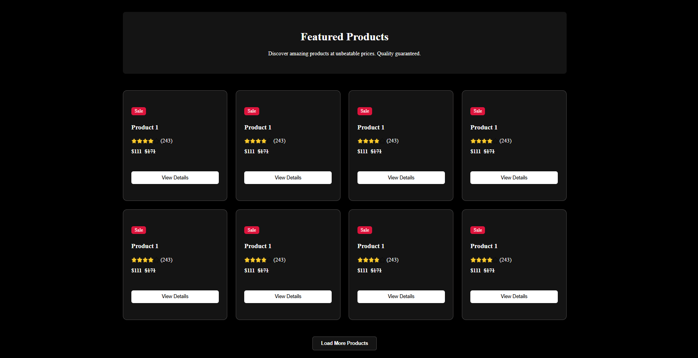

<h1>🛍️ Featured Products UI</h1>

A simple HTML + CSS responsive product card grid layout.
This project displays a list of featured products with sale badges, star ratings, and action buttons. 

<h1>📌 Features</h1>

✅ Clean & responsive design
✅ Grid layout with cards
✅ Product details section (title, price, rating, reviews)
✅ "Sale" badge & wishlist button
✅ Hover effects for interactivity
✅ "Load More Products" button

project-folder/
│── index.html
│── css/
│   └── style.css
│── images/
│   ├── star.png
│   ├── star1.png
│   └── (other icons/images)

<h1>🚀 Getting Started</h1>

Clone this repository:
git clone https://github.com/your-username/featured-products-ui.git

Navigate to the project folder:
cd featured-products-ui

Could you open the index.html file in your browser?

<h1>Preview</h1>

💻 Desktop View:

4 products per row
📱 Mobile View:
1 product per row

<h1>🛠️ Technologies Used</h1>

HTML5 – Structure
CSS3 – Styling & responsiveness

<h1>Screenshots</h1>
### 🖥️ Desktop View  

<h1>🤝 Contributing</h1>

Want to improve this project?
Fork the repo
Create a new branch
Make your changes
Submit a pull request

<h1>License</h1>
This project is open-source and available for free use.

